# A Quiz app 
## built over Laravel 8 and using jetstream inertia
- https://laravel.com/docs/8.x/homestead
- https://jetstream.laravel.com/2.x/stacks/inertia.html

Pre-requisite:
- PHP 7.x+
- MySQL 5.x+
- composer
- node

Local set-up:

    - composer install
    - npm install
    - php artisan migrate
    - php artisan db:seed
    - php artisan serve
    - npm run dev
    

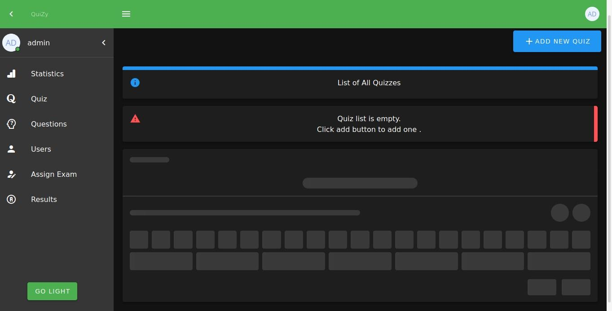

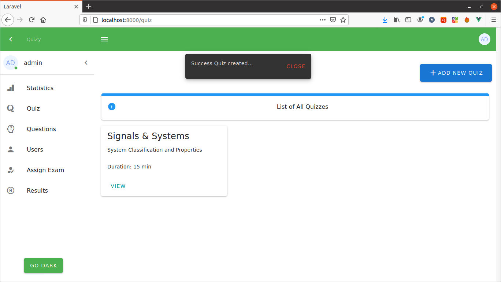

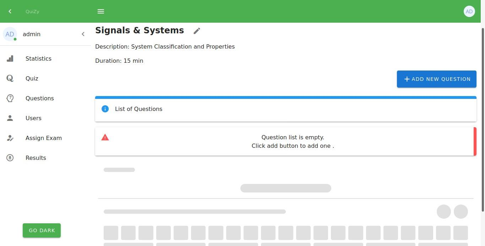

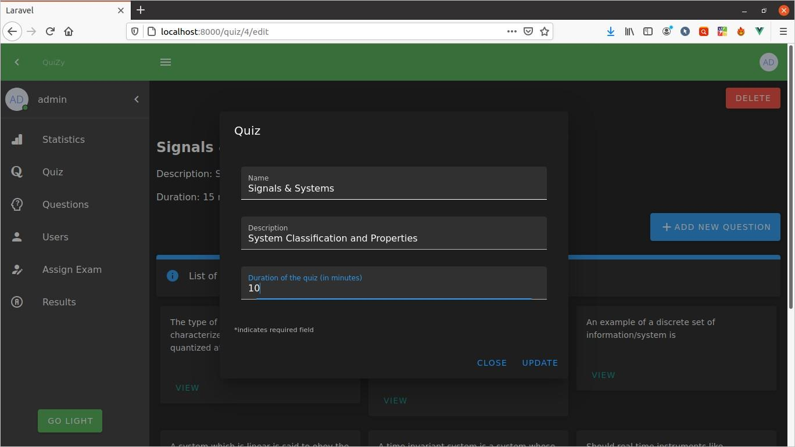

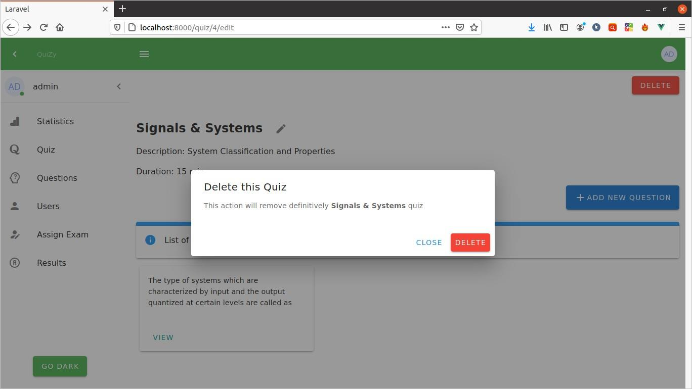

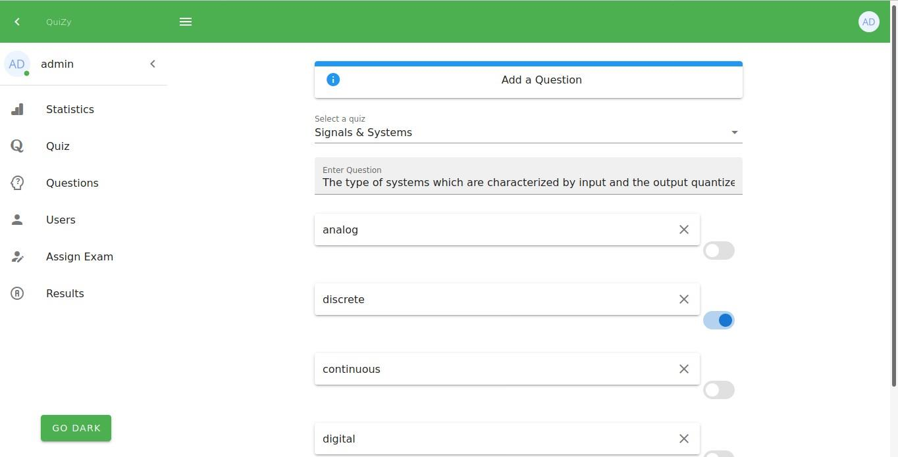

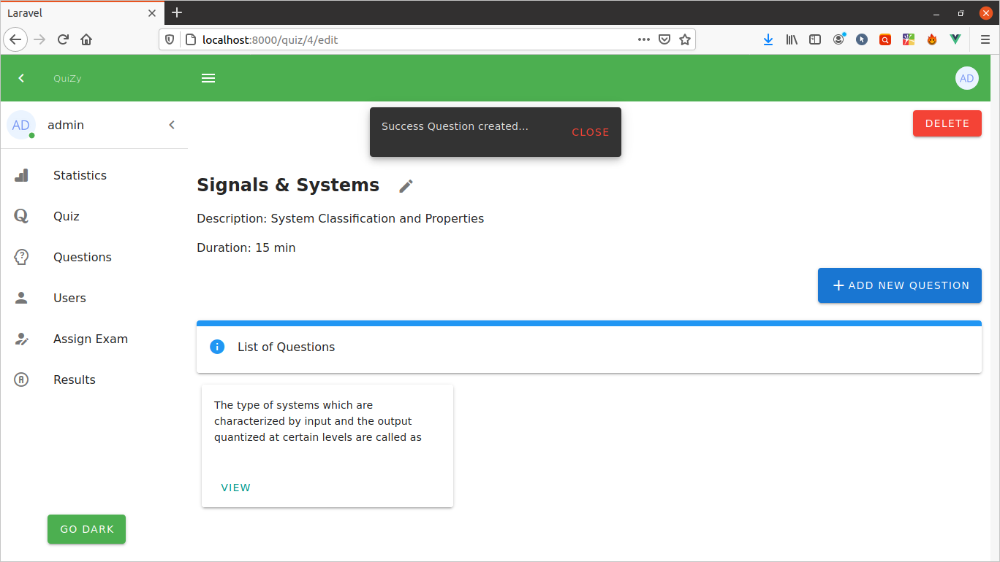

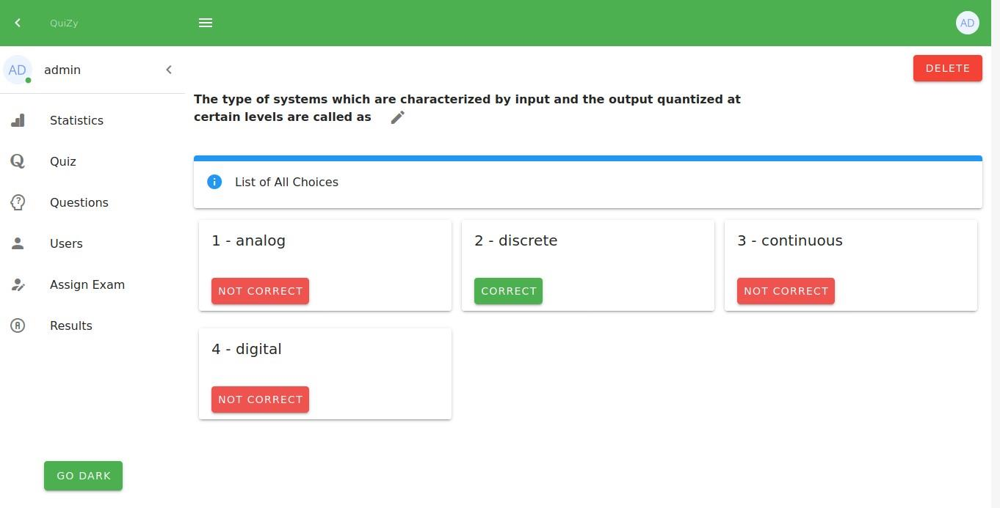

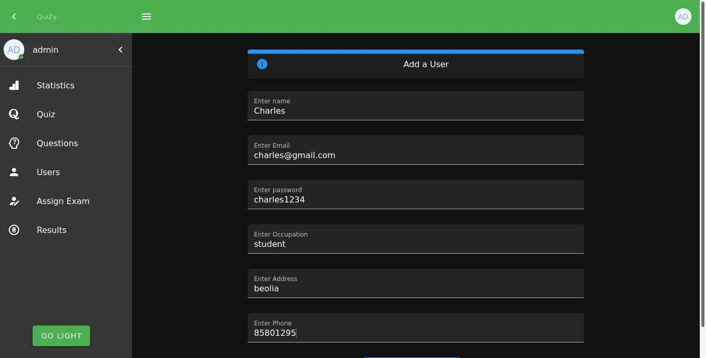

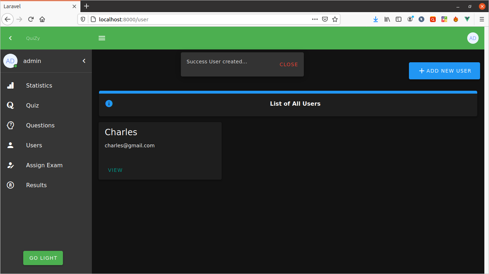

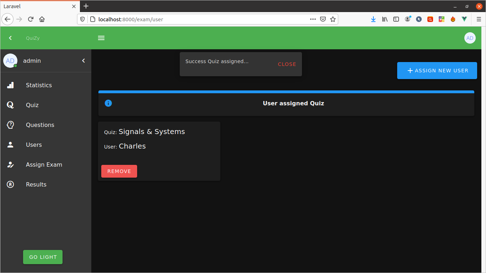

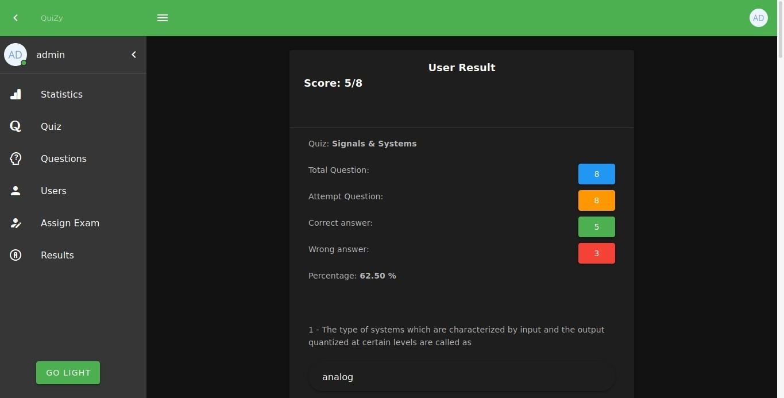
